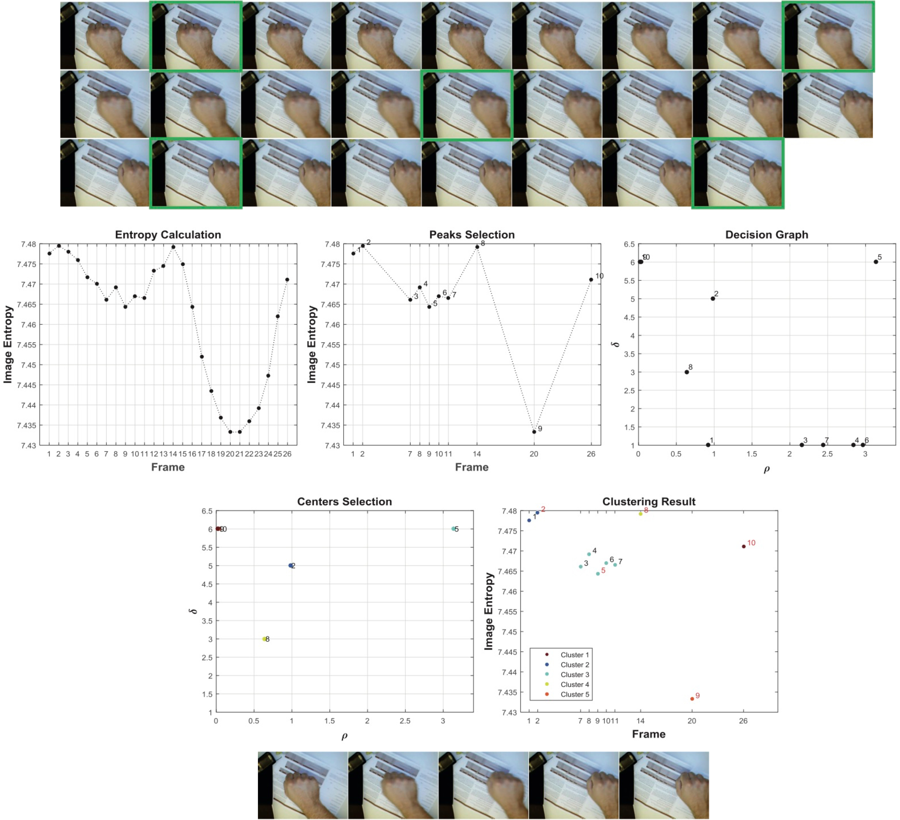

[](https://github.com/Ha0Tang/HandGestureRecognition/blob/master/LICENSE.md)


[](https://github.com/Ha0Tang/HandGestureRecognition/graphs/commit-activity)


[](https://GitHub.com/Ha0Tang/HandGestureRecognition/issues/)

# Key Frames Extraction and Feature Fusion for Dynamic Hand Gesture Recognition

## Key Frames Extraction Framework


## Feature Fusion Module


### [Project page](http://disi.unitn.it/~hao.tang/project/HandGestureRecognition.html) | [Paper](https://arxiv.org/abs/1901.04622)

Fast and Robust Dynamic Hand Gesture Recognition via Key Frames Extraction and Feature Fusion.<br>
[Hao Tang](http://disi.unitn.it/~hao.tang/)<sup>1</sup>,  [Hong Liu](https://scholar.google.com/citations?user=4CQKG8oAAAAJ&hl=en)<sup>2</sup>, Wei Xiao<sup>3</sup> and [Nicu Sebe](https://scholar.google.com/citations?user=stFCYOAAAAAJ&hl=en)<sup>1</sup>.<br> 
<sup>1</sup>University of Trento, Italy, <sup>2</sup>Peking University, China, <sup>3</sup>Lingxi Artificial Intelligence Co., Ltd, China.<br>
In Neurocomputing 2019.
<br>
The repository offers the official implementation of our paper in MATLAB.

### [License](./LICENSE.md)

Copyright (C) 2019 University of Trento, Italy.

All rights reserved.
Licensed under the [CC BY-NC-SA 4.0](https://creativecommons.org/licenses/by-nc-sa/4.0/legalcode) (**Attribution-NonCommercial-ShareAlike 4.0 International**)

The code is released for academic research use only. For commercial use, please contact [hao.tang@unitn.it](hao.tang@unitn.it).

## Installation

Clone this repo.
```bash
git clone https://github.com/Ha0Tang/HandGestureRecognition
cd HandGestureRecognition/
```

This code requires MATLAB. Please install it.

## Dataset Preparation

For Cambridge Hand Gesture or Northwestern Hand Gesture, the datasets must be downloaded beforehand. Please download them on the respective webpages.  Please cite their papers if you use the data. 

**Preparing Cambridge Hand Gesture Dataset**. The dataset can be downloaded [here](https://labicvl.github.io/ges_db.htm). You can also download this dataset use the following script:
```bash
bash ./datasets/download_handgesture_dataset.sh Cambridge_Hand_Gesture
```

**Preparing Northwestern Hand Gesture Dataset**. The dataset is proposed in this [paper](https://www.sciencedirect.com/science/article/pii/S0262885611001193). You can download this dataset use the following script:
```bash
bash ./datasets/download_handgesture_dataset.sh Northwestern_Hand_Gesture
```

**Preparing HandGesture Dataset**. This dataset consists of 132 video sequences of 640 by 360 resolution, each of which recorded from a
different subject (7 males and 4 females) with 12 different gestures (“0”-“9”, “NO” and “OK”). Download this dataset use the following script:
```bash
bash ./datasets/download_handgesture_dataset.sh HandGesture
```

**Preparing Action3D Dataset**. This dataset consists of 1620 image sequences of 6 hand gesture classes (box, high wave, horizontal wave, curl, circle and hand up), which are defined by 2 different hands (right and left hand) and 5 situations (sit, stand, with a pillow, with a laptop
and with a person). Each class contains 270 image sequences (5 different situations × 2 different hands × 3 times × 9 subjects). Each sequence was recorded in front of a fixed camera having roughly isolated gestures in space and time. All video sequences were uniformly resized into
320 × 240 in our method. Download this dataset use the following script:
```bash
bash ./datasets/download_handgesture_dataset.sh Action3D
```

## Training New Models

New models can be trained with the following commands.

1. Prepare your own dataset like in this [folder](https://github.com/Ha0Tang/HandGestureRecognition/tree/master/datasets/sample).

2. Extract key frame:

```bash
matlab -nodesktop -nosplash -r "key_frames_extraction"
```
Key frames will be extrated in the folder `./datasets/sample_keyframe`.

## Related Works

- [Clustering by Fast Search-and-Find of Density Peaks](https://people.sissa.it/~laio/Research/Res_clustering.php)
- [Gender Classification using Pyramid Segmentation for Unconstrained Back-Facing Video Sequences](https://www.researchgate.net/publication/311488680_Gender_Classification_Using_Pyramid_Segmentation_for_Unconstrained_Back-facing_Video_Sequences)

## Citation

If you use this code for your research, please cite our papers.
```
@article{tang2019fast,
  title={Fast and Robust Dynamic Hand Gesture Recognition via Key Frames Extraction and Feature Fusion},
  author={Tang, Hao and Liu, Hong and Xiao, Wei and Sebe, Nicu},
  journal={Neurocomputing},
  volume={331},
  pages={424--433},
  year={2019},
  publisher={Elsevier}
}
```

## Acknowledgments
This work is partially supported by National Natural Science Foundation of China (NSFC, U1613209), Shen- zhen Key Laboratory for Intelligent Multimedia and Virtual Reality (ZDSYS201703031405467), Scientific Research Project of Shenzhen City (JCYJ20170306164738129).

## Contributions
If you have any questions/comments/bug reports, feel free to open a github issue or pull a request or e-mail to the author Hao Tang ([hao.tang@unitn.it](hao.tang@unitn.it)).

